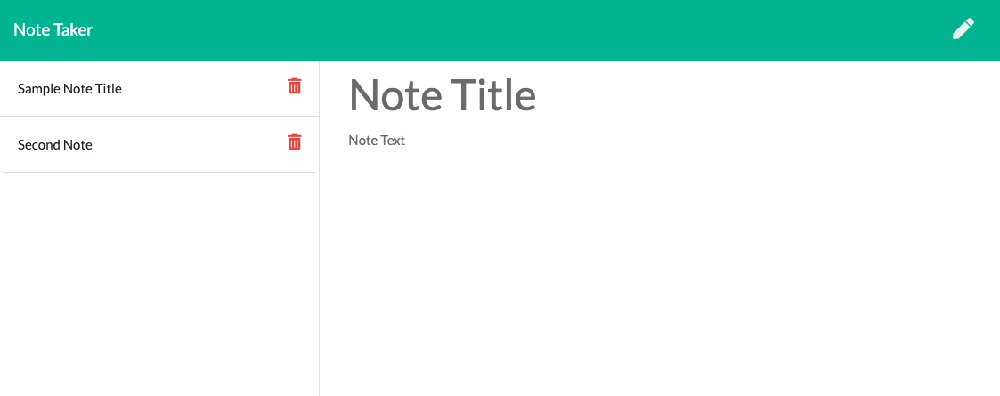
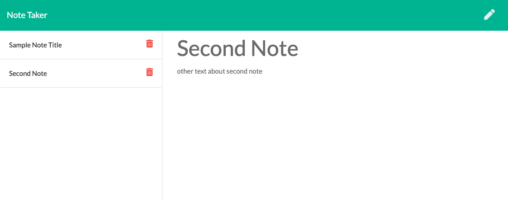

# Note Taker

## Description 

The purspose of the application is to allow the user to generate notes, save them, and then delete them. 

### Usage
Users simply need to open the app, type in a note and click the save button. The note title will appear on the left hand side of the screen. To view the note, just click on the title name and it will appear in the main window on the right hand side. To delete the note, simple click the trash can. This app uses express and a local server to store the data from the user and render it on the screen. 

### Screenshots
#### Home Screen With No Notes:

#### Notes LIsted on the Left Side:

#### Retreiving a note back to the main screen:

### Links
Link to github reposity: https://github.com/gtscott90/note-taker
Link to deployed application: https://gentle-lake-29955.herokuapp.com/ 
